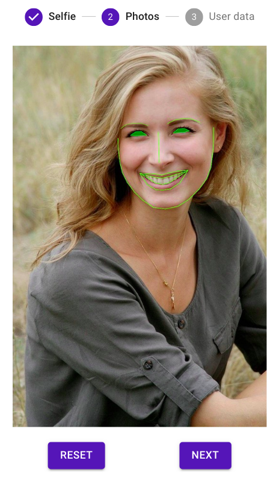
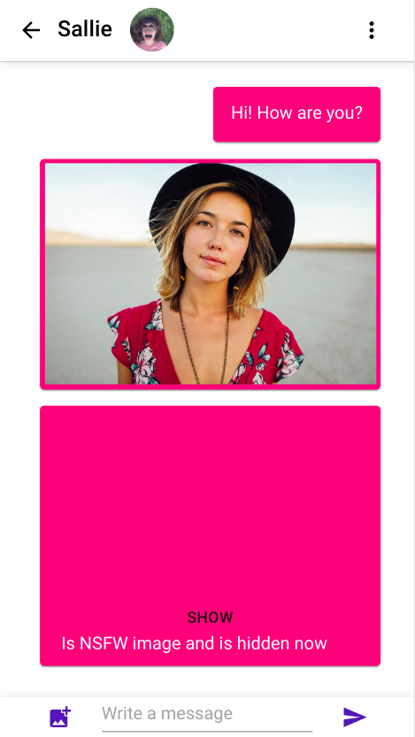
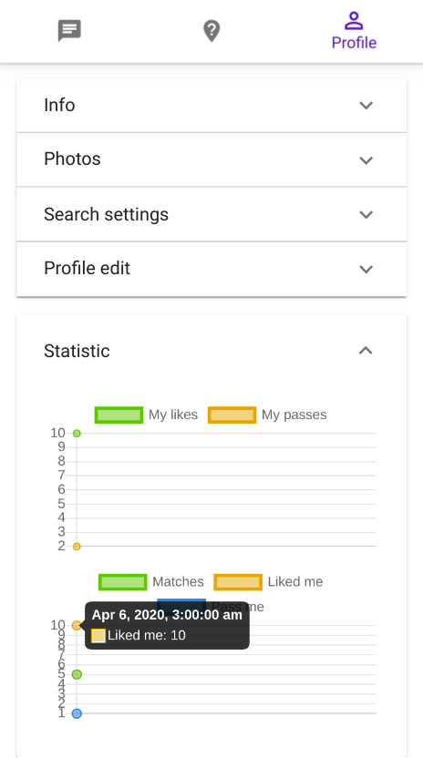
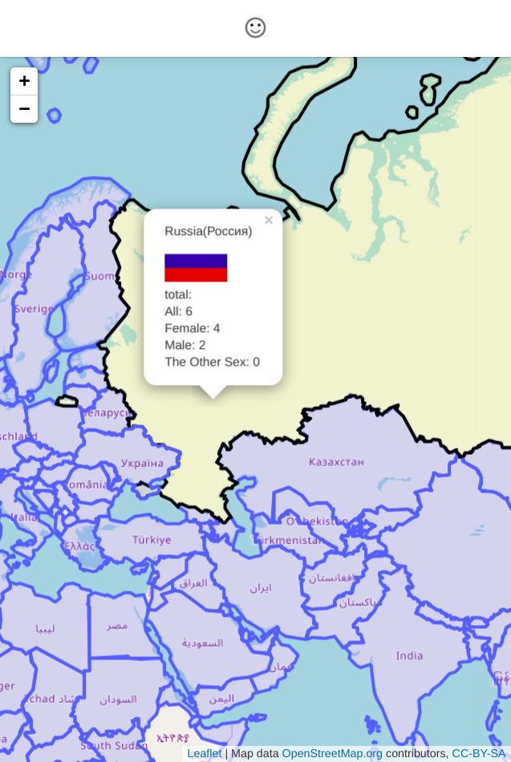
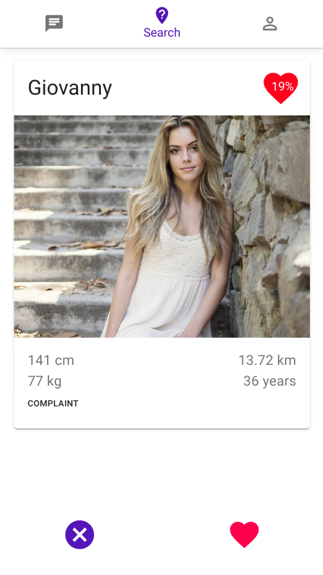

# od-universal-front

[](https://hub.docker.com/repository/docker/opendating/od-universal-front/tags)

[](https://codecov.io/gh/open-dating/od-universal-front)
[](https://deepscan.io/dashboard#view=project&tid=2754&pid=9569&bid=126329)


Open Dating is open source project like Tinder and others similar service, with lot of differents:

| | | | | |
| ------------- | ------------- | ------------- | ------------- |:-------------:|
|  | |  |  |  |
| We realy use dnn for help find couples(by face similarity) | You can send photo in im(we protect you from nsfw)| You can see you stats | And stats in your country | And many others things|

Main ideas:
 - all code is open
 - no fake accounts, paid chats and scams [[link](https://www.tokyoreporter.com/crime/tokyo-dating-site-registered-2-8-million-men-1-woman/)]
 - user profile stats opened for owner, statistics by countries opened for all people
 - people can allow scientists to use their data from the service in order to study the problems of society and solve demographic problems
 - we use science for help people find couple (now used face similarity [[link](https://www.mic.com/articles/111010/there-s-a-disturbing-fact-about-the-people-we-choose-to-be-with)][[link](https://journals.sagepub.com/doi/10.1177/0146167210377180)])
 - payment of servers, etc. will be through donations

More info on project site: https://open-dating.org/

## Development
```shell script
npm run start
```

## Build
```shell script
# install docker and make
# docker - https://docs.docker.com/install/
# make - https://www.gnu.org/software/make/

# build and run container
make build-n-run
```

## Test
```
npm run test
```

## Mobile
For mobile version used: https://cordova.apache.org/

At first, go to https://console.firebase.google.com/ create project and save file for Cloud Messaging as:
google-services.json - for android
GoogleService-Info.plist - for ios
in root project dir

Install requirements: https://cordova.apache.org/docs/en/latest/guide/platforms/android/index.html#installing-the-requirements

Run on phone or android emulator
```shell script
make cordova-run-on-phone-or-emulator-in-ubuntu
```
Or
```shell script
mkdir www || echo "" # create www dir
npm run build-cordova # create build in www dir
cordova platform add android || echo "" # add android platform or skip
cordova requirements android # check req
cordova run android --verbose # run on emulator
```

For connect to local backend: https://github.com/open-dating/od-backend from phone,
you can connect to your network(via wifi), create .env file with backend ip, for example:
```
REACT_APP_HOST=http://192.168.1.65:4300
```

If you cant view pics, in you backend manually set host - create .env file in backend root folder with backend ip:
```
HOST=http://192.168.1.65:4300
```

## Roadmap
* [x] connect to sentry
* [x] create and add logo
* [x] check fcm notifications
* [ ] fix small layouts bugs
* [ ] add donat page
* [ ] add tos page
* [ ] check translate
* [ ] show more user profile fields in user profile
* [x] add more user profile fields and settings for edit
* [ ] publish version for android in Google Play
* [ ] write more tests
* [x] add multilang support
